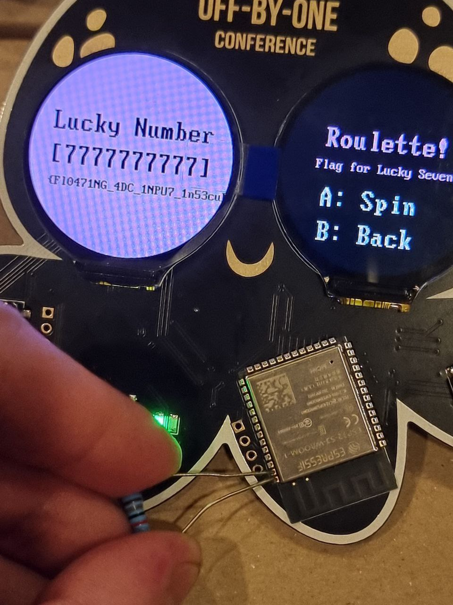

# Solutions to Hardware Challenge

### USB - USB Descriptor

> STARLABS_S3/sdkconfig.board

The first flag is hidden in the ***USB string descriptors***.

    $ lsusb -vd 303a:
    iManufacturer           1 STAR LABS SG
    iProduct                2 #BadgeLife
    iSerial                 3 {Welcome_To_OffByOne_2024}
    
    $ dmesg -w
    [3240249.488872] usb 3-3.2: New USB device found, idVendor=303a, idProduct=4001, bcdDevice= 1.00
    [3240249.488883] usb 3-3.2: New USB device strings: Mfr=1, Product=2, SerialNumber=3
    [3240249.488887] usb 3-3.2: Product: #BadgeLife
    [3240249.488889] usb 3-3.2: Manufacturer: STAR LABS SG
    [3240249.488892] usb 3-3.2: SerialNumber: {Welcome_To_OffByOne_2024}


### MicroPython - usermod library

> flaglib/flag.c

Find out that there is a ***C-compiled internal library*** `flaglib`. 

    >>> help('modules')
    [...] flaglib [...]

    >>> import flaglib
    >>> dir(flaglib)
    ['__class__', '__name__', '__dict__', 'getflag']

Intended solution is to write a script to exfilterate each character.

    >>> flaglib.getflag("")
    ''
    >>> flaglib.getflag("{____________________________}")
    '{??_????????_??????_??????????'

    >>> flaglib.getflag("{my_compiled_python_library}")
    '{my_compiled_python_library}'

Alternatively, you may extract out the ESP32-S3 firmware and reverse the assembly.

### MicroPython - Hardware Random Number

> starlabs/roulette.py.txt

Find out that there is a ***MicroPython-compiled library*** `roulette`. It can also be accessed through the display menu.

    >>> from starlabs import roulette
    >>> roulette.roulette()
    ([1, 0, 1, 2, 1, 2, 2, 1, 2, 2], None)



Intended solution is to understand that naive-method of RNG is generated from ADC noise. 

This is especially so on older microcontrollers with no RNG peripherals.

Upon shorting or soldering the pin to ground, the number is always 77777 and the flag will print out. 

Alternative solution is to extract the compiled `.mpy` file and reverse it. 

### Arduino - I2C Challenge

User needs to scan the I2C bus and read the data from each address.

    >>> arduino.i2c.scan()
    [48, 49] 
    # In hex: 0x30 and 0x31

#### At I2C Address 0x30

Perform a ***read request from the I2C slave***.

    >>> arduino.i2c.scan()
    [48, 49]

    >>> arduino.i2c.readfrom(0x30, 100).rstrip(b'\xff')
    b'Welcome to STAR LABS CTF. Your first flag is starlabs{i2c_flag_1}'

#### At I2C Address 0x31

Perform a read request from the I2C slave.

    b'The early bird catches the worm. System uptime: 221. You are too late. Reboot the arduino and try again.'

The challenge tells you to read the flag quickly based on the system uptime.

***Perform "timing attack"*** by resetting the MCU, waiting a known amount of time and performing an I2C read. Due to timing variance, the process may need to be repeated until the respective chars are obtained. 

In the MicroPython REPL, run the following code:

```python
def derp(x):
  global arduino
  arduino.off()
  time.sleep(1) # shutdown the arduino
  arduino.on()
  time.sleep(x); # turn on and wait a known amount of time
  return arduino.i2c.readfrom(0x31, 200).rstrip(b'\xff') # immediately read

for i in range(200, 500): print(derp(0.01*i))
```

An example output

    b'The early bird catches the worm. System uptime: 197. You too early, wait a little longer!'
    b'The early bird catches the worm. System uptime: 198. You too early, wait a little longer!'
    b'The early bird catches the worm. System uptime: 199. You too early, wait a little longer!'
    b'The early bird catches the worm. System uptime: 200. You are an early bird, here is your gift: s'
    b'The early bird catches the worm. System uptime: 201. You are an early bird, here is your gift: t'
    b'The early bird catches the worm. System uptime: 201. You are an early bird, here is your gift: t'
    b'The early bird catches the worm. System uptime: 202. You are an early bird, here is your gift: a'
    b'The early bird catches the worm. System uptime: 203. You are an early bird, here is your gift: r'
    b'The early bird catches the worm. System uptime: 203. You are an early bird, here is your gift: r'
    b'The early bird catches the worm. System uptime: 204. You are an early bird, here is your gift: l'
    b'The early bird catches the worm. System uptime: 204. You are an early bird, here is your gift: l'
    b'The early bird catches the worm. System uptime: 205. You are an early bird, here is your gift: a'
    b'The early bird catches the worm. System uptime: 206. You are an early bird, here is your gift: b'
    b'The early bird catches the worm. System uptime: 206. You are an early bird, here is your gift: b'
    b'The early bird catches the worm. System uptime: 207. You are an early bird, here is your gift: s'
    b'The early bird catches the worm. System uptime: 208. You are an early bird, here is your gift: {'
    b'The early bird catches the worm. System uptime: 208. You are an early bird, here is your gift: {'
    b'The early bird catches the worm. System uptime: 209. You are an early bird, here is your gift: i'
    b'The early bird catches the worm. System uptime: 209. You are an early bird, here is your gift: i'
    b'The early bird catches the worm. System uptime: 210. You are an early bird, here is your gift: 2'
    b'The early bird catches the worm. System uptime: 211. You are an early bird, here is your gift: c'
    b'The early bird catches the worm. System uptime: 211. You are an early bird, here is your gift: c'
    b'The early bird catches the worm. System uptime: 212. You are an early bird, here is your gift: _'
    b'The early bird catches the worm. System uptime: 212. You are an early bird, here is your gift: _'
    b'The early bird catches the worm. System uptime: 213. You are an early bird, here is your gift: f'
    b'The early bird catches the worm. System uptime: 214. You are an early bird, here is your gift: l'
    b'The early bird catches the worm. System uptime: 214. You are an early bird, here is your gift: l'
    b'The early bird catches the worm. System uptime: 215. You are an early bird, here is your gift: a'
    b'The early bird catches the worm. System uptime: 216. You are an early bird, here is your gift: g'
    b'The early bird catches the worm. System uptime: 216. You are an early bird, here is your gift: g'
    b'The early bird catches the worm. System uptime: 217. You are an early bird, here is your gift: _'
    b'The early bird catches the worm. System uptime: 217. You are an early bird, here is your gift: _'
    b'The early bird catches the worm. System uptime: 218. You are an early bird, here is your gift: 3'
    b'The early bird catches the worm. System uptime: 218. You are an early bird, here is your gift: 3'
    b'The early bird catches the worm. System uptime: 219. You are an early bird, here is your gift: }'
    b'The early bird catches the worm. System uptime: 220. You are an early bird, here is your gift: '
    b'The early bird catches the worm. System uptime: 220. You are an early bird, here is your gift: '
    b'The early bird catches the worm. System uptime: 221. You are too late. Reboot the arduino and try again.'
    b'The early bird catches the worm. System uptime: 222. You are too late. Reboot the arduino and try again.'

### Arduino - Voltage Glitching

When we connect a USB-UART adapter to the "hidden" Arduino, we see this message indicating that the flag can be obtained only by glitching past the if-statement.

    Flag is Locked! Please help me to jailbreak it.
    int i = 0, k = 0;
    for (i = 0; i < 123456; i++) k++;
    if (k != 123456) { unlock(); } else { lock(); }

From the MicroPython REPL, we see that the Arduino can be turned on and off

    >>> arduino
    <MyArduino object at 3fcaac10>
    >>> dir(arduino)
    ['__class__', '__init__', '__module__', '__qualname__', '__dict__', 'off', 'on', 'i2c']

In order to perform a glitch, we quickly toggle the power. 

    >>> arduino.on(); arduino.off(); arduino.on();

We see the flag popup if we are lucky

    Flag is Locked! Please help me to jailbreak it.
    int i = 0, k = 0;
    for (i = 0; i < 123456; i++) k++;
    if (k != 123456) { unlock(); } else { lock(); }

    This should not happen! k=123271
    Unlocked. Here is your flag starlabs{voltage_glitching_is_cool}
    
> Due to variance in manufacturing, it may not be easily reproducible, as we see that the toggle may causes the Arduino to reboot entirely rather than glitch. This is because the power may be drained too quickly. By identifying nearby components (Qx1: MOSFET), we understand that the power is toggled through a MOSFET transistor. There is also see a "Glitcher" test point which connects across the MOSFET transistor. We can make the glitch more reproducible by soldering either a capacitor or resistor across the MOSFET transistor.

---

